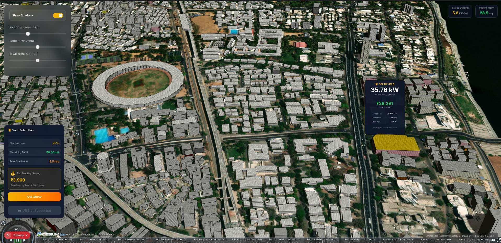
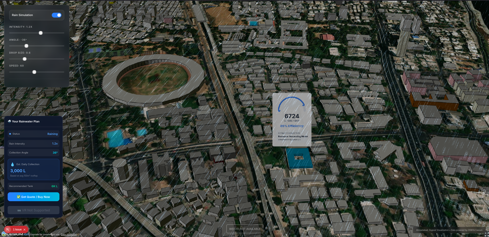
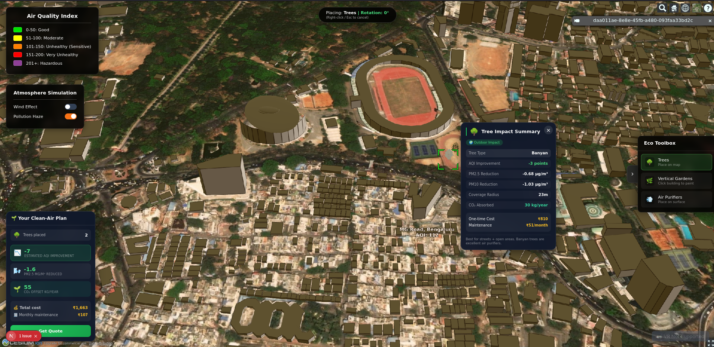
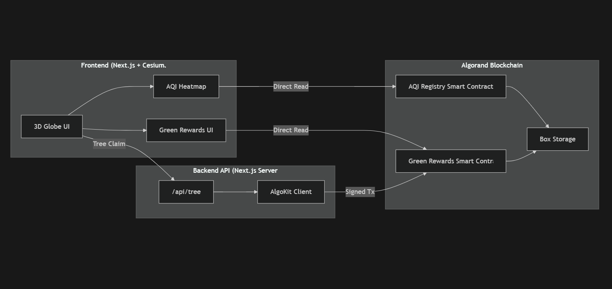
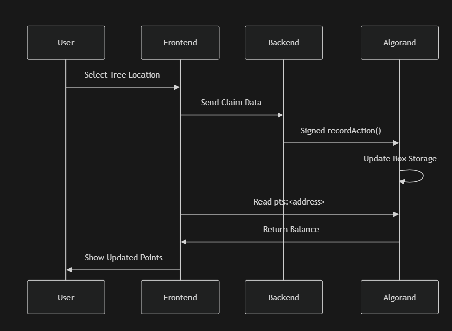
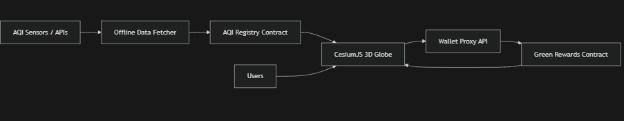

<h2 align="center">
  
</h2>

<p align="center">
  
</p>


<p align="center">
  
  
  
  
  


  
  
  
  
  
</p>

## ✨ Demo

`AeroChain` Decentralized platform that connects atmospheric intelligence with Earth-scale visualization using blockchain:


<!-- ☀️ Solar & 💧 Water Full Width Side by Side -->
<p align="center">
  
  
</p>

<!-- 🌫️ AQI Section Full Width -->
<p align="center">
  
</p>


<h2 align="center">The Problem We're Solving</h2>

<p align="center">
  
  
</p>

<br/>

Right now, climate action suffers from two massive problems: **lack of transparency** and **lack of engagement**. 

People and companies claim to plant trees or reduce emissions, but how do we *prove* it? And for the everyday user, environmental dashboards are just boring spreadsheets. 

AeroEarth fixes both:
1. **Gamified Action:** We turn climate awareness into an immersive 3D experience using CesiumJS.
2. **Absolute Proof:** By storing both the starting pollution data and the user's mitigation actions (carbon offsets) on-chain, we create a transparent, tamper-proof record of who is actually helping the planet.


<h2 align="center">
  
</h2>

<p align="center">
  AeroEarth addresses the core challenges of climate action by combining engagement with verifiable accountability.
</p>

<br><br>

<!-- 🌍 Main Demo Image Full Width -->
<p align="center">
  
</p>


1. **Gamified Climate Action:**  
   We transform climate awareness into an immersive 3D Earth experience powered by CesiumJS. Instead of static dashboards, users interact with real-world environmental data in a dynamic and intuitive way.
   

2. **On-Chain Transparency:**  
   Both the baseline pollution data and user mitigation actions are stored on-chain. This creates a transparent, tamper-proof, and publicly verifiable record of measurable climate impact.

<br/>


<br/>

<p align="center">
  
</p>


<h2 align="center"> Why We Chose Algorand</h2>


<!-- Animated Subheading -->
<p align="center">
  
</p>

<ul>
  <li><b> Carbon Negative & Fast:</b> Carbon-negative blockchain with sub-3-second finality. Building an eco dApp on an energy-hungry chain makes zero sense.</li>
  <li><b> Ultra-Low Transaction Fees:</b> ~0.001 ALGO per transaction — perfect for logging thousands of environmental actions.</li>
  <li><b> Box Storage (BoxMap):</b> Unlimited on-chain map storage with O(1) read access. No centralized database required.</li>
  <li><b> TypeScript Smart Contracts (PuyaTs):</b> Smart contracts written fully in TypeScript, compiled directly into AVM bytecode via AlgoKit.</li>
</ul>

<!-- Footer Wave -->
<p align="center">
  
</p>

---

## Why an Agentic Architecture?

Most environmental dashboards are **passive** — they show you data and wait for humans to act. AeroEarth takes a fundamentally different approach with an **autonomous AI agent** that continuously monitors, reasons, decides, and acts on environmental data without human intervention.

### The Core Idea

Traditional systems follow a simple flow: `Sensor → Dashboard → Human → Action`. This is slow, reactive, and doesn't scale. AeroEarth introduces an **agentic loop** where an AI agent autonomously:

1. **Observes** — Ingests real-time environmental telemetry (AQI, water quality, solar irradiance) across multiple geographic zones.
2. **Thinks** — Uses ML forecasting and LLM reasoning to understand trends, detect threshold violations, and predict future conditions.
3. **Decides** — Autonomously selects the optimal intervention (tree planting, water conservation, or solar adoption) with cost estimates and impact predictions.
4. **Acts** — Deploys citizen quests, mints on-chain commitment NFTs, and records decisions to the blockchain for tamper-proof accountability.
5. **Verifies** — Compares its own predictions against actual outcomes in subsequent cycles, creating a self-improving feedback loop.

### Why Not Just a Dashboard?

| Aspect | Traditional Dashboard | AeroEarth Agent |
|:-------|:---------------------|:----------------|
| **Response Time** | Hours/days (human bottleneck) | Seconds (autonomous cycle) |
| **Decision Making** | Manual analysis required | LLM-powered reasoning with policy checks |
| **Accountability** | Spreadsheets, reports | Immutable on-chain NFT records |
| **Engagement** | Passive data viewing | Gamified citizen quests with reward points |
| **Verification** | Periodic manual audits | Automated predict-vs-actual accuracy tracking |
| **Scalability** | Limited by human operators | Runs across unlimited zones simultaneously |

---

# Architecture

<p align="center">
  
</p>

###  8-Node Autonomous Execution Pipeline

The agent runs as a **directed acyclic graph (DAG)** of 8 specialized nodes, each executing sequentially in every cycle:

```
┌──────────────┐    ┌──────────────┐    ┌──────────────┐    ┌──────────────┐
│  1. INGEST   │───▶│ 2. FORECAST  │───▶│ 3. THRESHOLD │───▶│ 4. REASONING │
│  Fetch env   │    │  ML multi-   │    │  Detect      │    │  Claude LLM  │
│  sensors     │    │  var models  │    │  violations  │    │  reasoning   │
└──────────────┘    └──────────────┘    └──────────────┘    └──────────────┘
                                                                    │
┌──────────────┐    ┌──────────────┐    ┌──────────────┐    ┌──────────────┐
│  8. VERIFY   │◀───│ 7. ON-CHAIN  │◀───│  6. QUEST    │◀───│  5. IMPACT   │
│  Compare &   │    │  NFT mint    │    │  Mobilize    │    │  Predict     │
│  calculate   │    │  Notarize... │    │  citizens    │    │  delta & ROI │
└──────────────┘    └──────────────┘    └──────────────┘    └──────────────┘
```

| Node | Purpose | Key Output |
|:-----|:--------|:-----------|
| **Data Ingestion** | Fetches real-time environmental sensor readings across all monitored zones | `ZoneState[]` — AQI, water quality, solar irradiance, temperature, humidity |
| **ML Forecasting** | Runs multi-variable LSTM models to project 24h/48h/72h environmental trends | `Forecast[]` — predicted conditions per zone |
| **Policy Checks** | Evaluates sensor readings + forecasts against safety thresholds and policy rules | `AlertZone[]` — flagged zones with severity levels |
| **LLM Agent** | Uses Claude 3.5 Sonnet to reason about alerts and determine optimal interventions | `AgentDecision[]` — action type, priority, cost estimates |
| **Impact Sim** | Predicts the environmental delta of each decision (CO₂ offset, people benefited) | `ImpactPrediction[]` — quantified projected outcomes |
| **Quest Engine** | Generates gamified citizen missions based on decisions to mobilize community action | `Quest[]` — title, rewards, progress tracking |
| **On-Chain NFT** | Mints tamper-proof climate commitment records on Algorand blockchain | `NFTRecord[]` — token ID, tx hash, IPFS metadata |
| **Verification** | Compares previous cycle predictions against current actuals to measure accuracy | `VerificationResult[]` — predicted vs actual delta, accuracy % |

<p align="center">
  
</p>

<p align="center">
  
</p>


## 🤗 LSTM Models — Hugging Face Spaces

<p align="center">
  <a href="https://huggingface.co/spaces/Ravikrishna-25/AQL-model">
    
  </a>

  <a href="https://huggingface.co/spaces/Ravikrishna-25/Water-LSTM">
    
  </a>

  <a href="https://huggingface.co/spaces/Ravikrishna-25/Solar-LSTM">
    
  </a>
</p>

<div align="center">

| Model | Description | Space |
|:------|:------------|:-----:|
| 🌫️ **AQI LSTM** | Air Quality Index prediction using LSTM neural network | [Live Demo ➜](https://huggingface.co/spaces/Ravikrishna-25/AQL-model) |
| 💧 **Water LSTM** | Water quality forecasting with time-series deep learning | [Live Demo ➜](https://huggingface.co/spaces/Ravikrishna-25/Water-LSTM) |
| ☀️ **Solar LSTM** | Solar energy output prediction using sequential models | [Live Demo ➜](https://huggingface.co/spaces/Ravikrishna-25/Solar-LSTM) |

</div>

---

## 🛠 Tech Stack
- **Blockchain:** Algorand (AVM), Algorand TypeScript, PuyaTs
- **Developer Tooling:** AlgoKit, Lora Explorer, `@algorandfoundation/algokit-utils`
- **Frontend Engine:** Next.js 15, React, CesiumJS (3D Globe)
- **Styling:** TailwindCSS
- **Backend:** Next.js API Routes (Server-side proxy for signing admin transactions)

---

## 💻 Installation & Local Setup

Want to run AeroEarth yourself? Here’s how:

### 1. Prerequisites
- Node.js (v18+)
- Docker Desktop (required to run the local blockchain)
- [AlgoKit CLI](https://developer.algorand.org/docs/get-started/algokit/) 

### 2. Spin up the Blockchain
```bash
# Start your local Algorand node
algokit localnet start
```

### 3. Deploy the Smart Contracts
```bash
git clone [repo-url]
cd [repo-directory]/blockchain

# Deploy the AQI Registry & seed the initial map data
npm install
npm run reset       

# Deploy the Green Rewards ledger
cd green-rewards
npm install
npm run deploy      
```

### 4. Boot the 3D Frontend
```bash
cd ../air2earth-chain

# Set up your environment variables
cp .env.example .env.local 

# Install and run
npm install
npm run dev
```
Open up `http://localhost:3000` and start saving the planet!

---


## ⚠️ Known Limitations & Future Roadmap
- **Network Dependency:** The current repo is configured for LocalNet for easy judging/testing. To run on TestNet, update the `NEXT_PUBLIC_ALGOD_SERVER` in your `.env`.
- **Hardware Profile:** Rendering 3D maps and high-res heatmaps via Cesium is GPU-intensive. It might stutter on older laptops.
- **Roadmap - Web3 Wallets:** Right now, the system tracks sessions and proxy addresses. Next up is native Pera Wallet / Defly integration so users hold their Green Points directly in their own wallets.

---
<p align="center">
  🤝 Contributors
</p>


<table align="center">
  <tr>
    <td align="center">
      <a href="https://github.com/SudharshanAIML">
        <br />
        <sub><b>@SudharshanAIML</b></sub>
      </a><br />
      <sub>3D Modeling & Animations</sub>
    </td>
    <td align="center">
      <a href="https://github.com/ThiruEigen7">
        <br />
        <sub><b>@ThiruEigen7</b></sub>
      </a><br />
      <sub>Frontend & UI/UX Engineer</sub>
    </td>
    <td align="center">
      <a href="https://github.com/call-meRavi-SHORT-CODE">
        <br />
        <sub><b>@call-meRavi-SHORT-CODE</b></sub>
      </a><br />
      <sub>AI/ML Engineer</sub>
    </td>
    <td align="center">
      <a href="https://github.com/Shashanth27">
        <br />
        <sub><b>@Shashanth27</b></sub>
      </a><br />
      <sub>Blockchain Engineer</sub>
    </td>
        <td align="center">
      <a href="https://github.com/R-Shanmuga18">
        <br />
        <sub><b>@R-Shanmuga18</b></sub>
      </a><br />
      <sub>VR Engineer</sub>
    </td>
  </tr>
</table>
